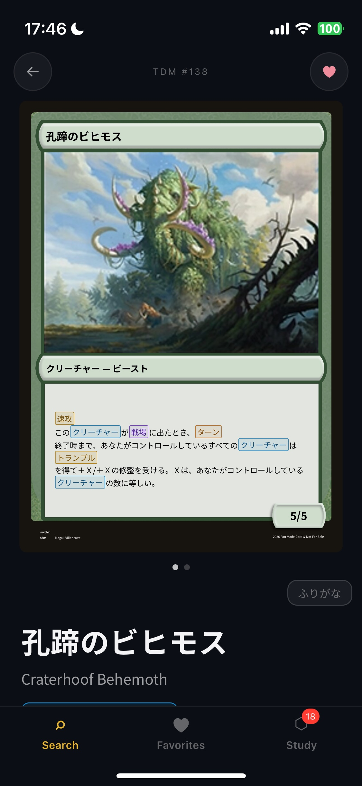
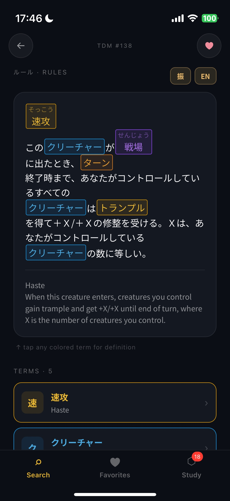
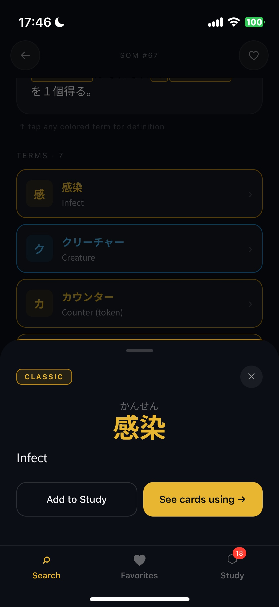
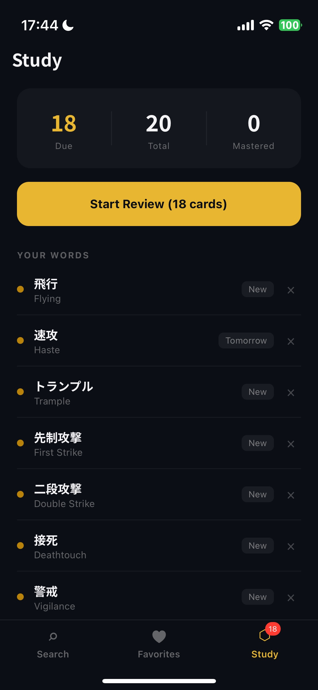
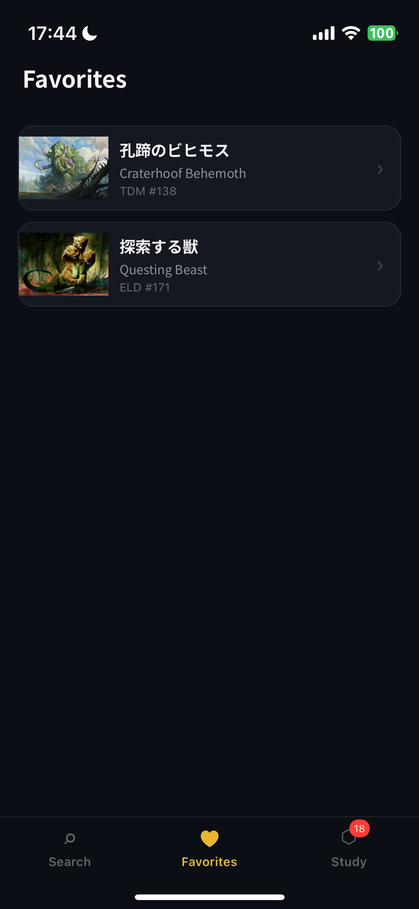

# MTG JP Study

A React Native app for learning Japanese through Magic: The Gathering cards. Search any card, read the Japanese rules text with an interactive tappable glossary, and build a personal vocabulary deck with spaced repetition reviews.


---

## Screenshots

| Card View | Rules Text | Keyword Popup |
|:---------:|:----------:|:-------------:|
|  |  |  |

| Study Screen | Favorites |
|:------------:|:---------:|
|  |  |

---

## Features

- **Card Search** — search by English name, romaji, kana, or kanji. Falls back to Scryfall's fuzzy matcher for OCR noise tolerance.
- **Camera Scan** — scan a physical card with your camera to look it up instantly.
- **Japanese Rules Text** — every card displays its official Japanese localization with color-coded tappable keywords.
- **Interactive Glossary** — tap any highlighted term to see its reading (furigana), English translation, and example cards that use it.
- **Study Sets** — browse 200+ MTG terms grouped by category (Evergreen, Actions, Zones, Card Types, etc.).
- **Spaced Repetition (SRS)** — add words to a personal deck and review them with an Anki-style SM-2 flashcard system. Cards show the Japanese term on the front, and reveal the reading, translation, and an example card image on the back.
- **Favorites** — heart any card to save it to a dedicated Favorites tab for quick access.
- **Word of the Day** — a new vocabulary term surfaces on the home screen each day.

---

## Tech Stack

| Layer | Technology |
|-------|-----------|
| Framework | React Native 0.81 / Expo SDK 54 |
| Navigation | React Navigation (Stack + Bottom Tabs) |
| Card Data | [Scryfall API](https://scryfall.com/docs/api) |
| OCR | rn-mlkit-ocr |
| Fonts | Noto Sans JP (400 / 700) |
| Storage | AsyncStorage |
| Notifications | expo-notifications (app icon badge) |

---

## Getting Started

```bash
# Install dependencies
npm install

# Start the dev server
npx expo start
```

Open in [Expo Go](https://expo.dev/go) or run on a simulator/device with `npx expo run:ios` / `npx expo run:android`.

---

## Project Structure

```
src/
├── components/        # Ruby (furigana), CardRenderer, InteractiveText, WordPopup
├── context/           # StudyContext — SRS deck state and AsyncStorage sync
├── screens/           # SearchScreen, CardScreen, StudyScreen, FavoritesScreen, …
└── utils/             # scryfall.ts, dictionary.ts, srs.ts, favorites.ts
```

---

## Data Sources

Card data, images, and Japanese localizations are fetched live from the [Scryfall API](https://scryfall.com/docs/api). MTG card names, rules text, and imagery are property of Wizards of the Coast. This project is a fan-made study tool and is not affiliated with or endorsed by Wizards of the Coast.
